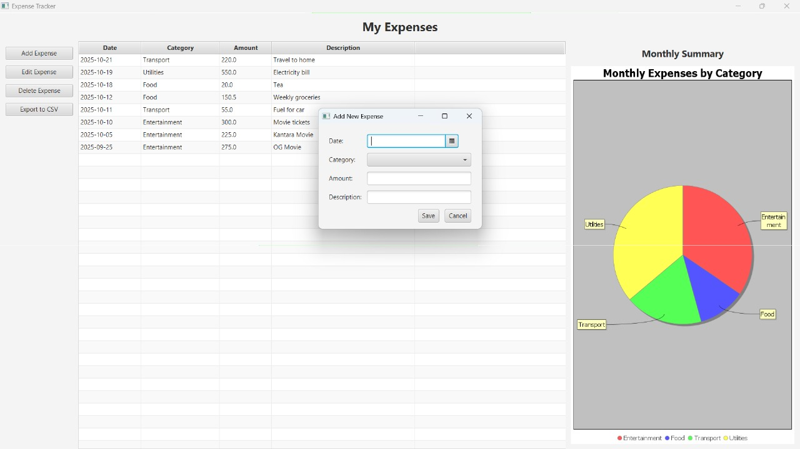
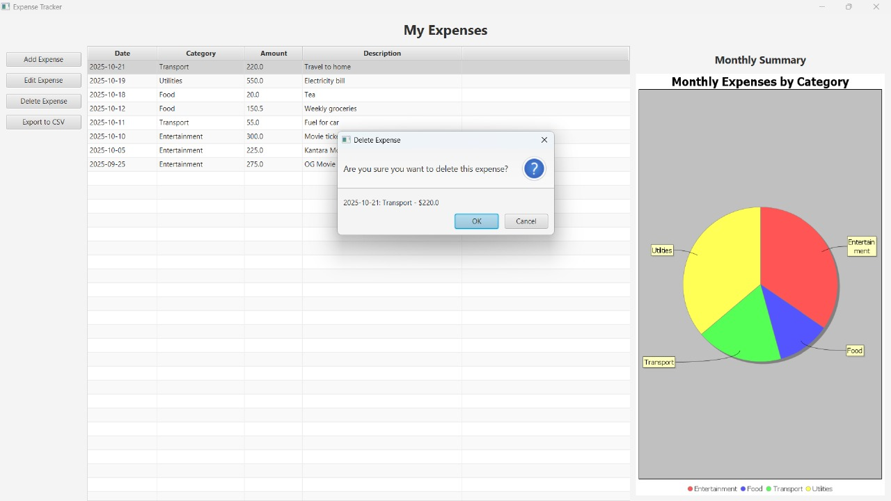
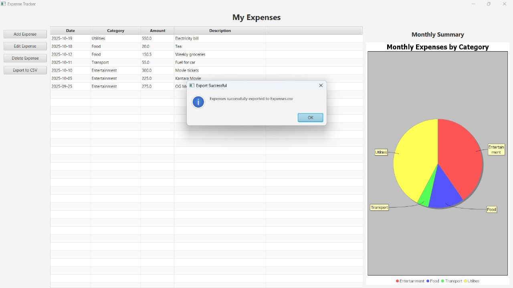

# JavaFX Expense Tracker

A full-stack, data-driven desktop application for managing personal expenses. This application allows users to track their spending with full CRUD (Create, Read, Update, Delete) functionality, visualize monthly summaries with a pie chart, and export data to a CSV file.


## Features & Screenshots

### Main Dashboard & Analytics

View all expenses, sorted by date. A dynamic pie chart (using JFreeChart) provides a visual summary of monthly spending by category.

### Add & Edit Expenses

A single, reusable form is used for both adding new expenses and editing existing ones. The form is launched as a modal dialog, and the category dropdown is dynamically populated from the database.

### Delete Confirmation

A confirmation dialog, which includes the details of the selected item, appears before any destructive action to prevent accidental data loss.

### Export to CSV

Export all expense data to a `.csv` file with a single click. A native file-save dialog allows the user to choose where to save the file.

---

## Technology Stack

* **Language:** Java (JDK 17)
* **Build Tool:** Apache Maven
* **User Interface (UI):** JavaFX (with FXML)
* **Database:** SQLite (via JDBC)
* **Charting Library:** JFreeChart

---

## Architecture

This project is built using the **Model-View-Controller (MVC)** design pattern to ensure a clean separation of concerns:

* **Model:** The `Expense.java` class represents the data structure.
* **View:** The `MainView.fxml` and `AddExpenseView.fxml` files define the UI layout.
* **Controller:** The `MainViewController` and `AddExpenseController` classes handle all user input and application logic.
* **Data Layer:** The `DatabaseManager.java` class encapsulates all JDBC connections and SQL queries, abstracting the database from the rest of the application.

---

## How to Run

### Prerequisites

* [Java Development Kit (JDK) 17](https://www.oracle.com/java/technologies/javase/jdk17-archive-downloads.html)
* [Apache Maven](https://maven.apache.org/download.cgi)

### Running the Application

1.  **Clone the repository (or download the source code):**
    ```sh
    git clone [https://github.com/your-username/ExpenseTracker.git](https://github.com/your-username/ExpenseTracker.git)
    cd ExpenseTracker
    ```

2.  **Compile and Run using the JavaFX Maven Plugin:**
    This project is configured to run using the `javafx-maven-plugin`. The following command will compile the project and launch the application:

    ```sh
    mvn clean javafx:run
    ```

The application will launch, and the `expenses.db` SQLite database file will be automatically created in the project's root directory if it doesn't already exist.